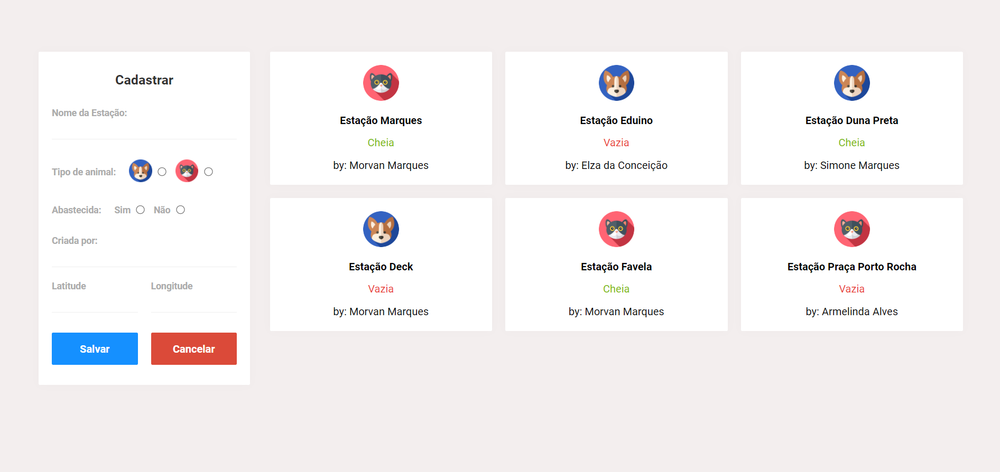
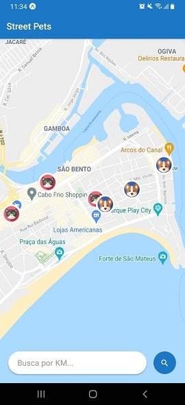

# StreetPets

## Description

This aplication was based on bootcamp OmniStack Week 10.0, RocketSeat.
The propose was build an aplication that sinalized stations for peoples colaborate with water and food to street's animals.

## Frontend Web

The user can register the station based in your geolocation and see the stations registred.



## Frontend Mobile

The user can search based in KM radius and see the information of stations.



## Getting Start

* Download the repository
* Create a cluster in mongodb
* npm i or yarn i in all three folders (backend, frontend-web, mobile)
* Inside backend/src create a file index.js like the exemple:
``` 
    const express = require('express');
    const mongoose = require('mongoose');
    const cors = require('cors')
    const routes = require('./routes');

    const app = express();

    mongoose.connect('mongodb+srv://<YOUR_USER>:<YOUR_PASSWORD>@cluster0.zoxkg.mongodb.net/test?retryWrites=true&w=majority', {
        useNewUrlParser: true,
        useUnifiedTopology: true,
    });

    app.use(cors());
    app.use(express.json());
    app.use(routes);

    app.listen(3333, () => {console.log('Executando...')}); 
    
```

* Start the three aplications (npm start or yarn start, expo start)
    * backend run: http://localhost:3333
    * frontend-web run: http://localhost:3000
    * mobile run: Where you choose run expo

## Learn More

To learn more about the techs, see:
* [React JS](https://reactjs.org/)
* [React Native](https://reactnavigation.org/docs/getting-started)

## Techs

* React JS
* React Native
* Node JS
* Expo